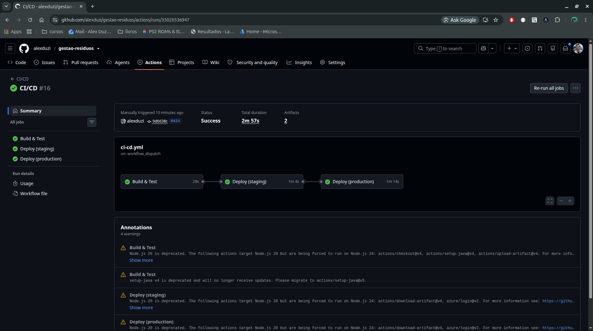
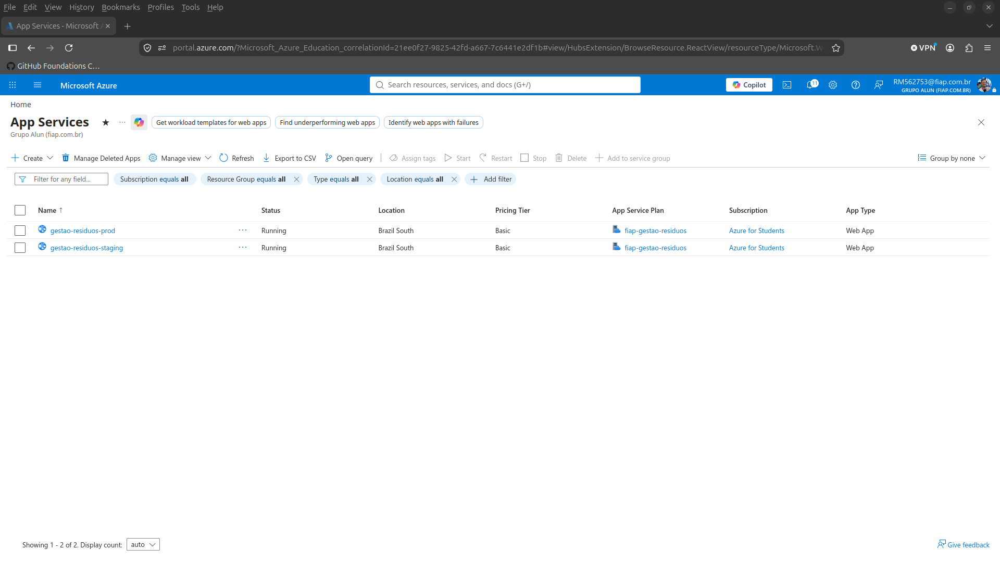
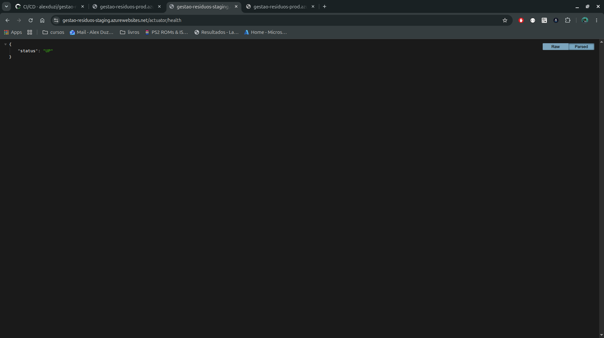
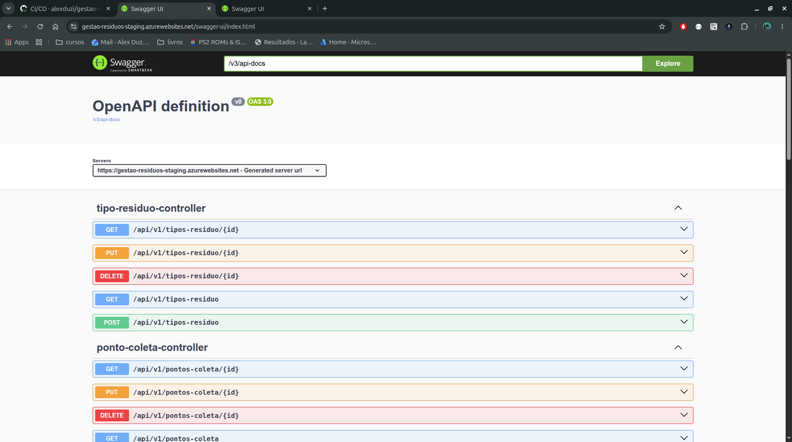
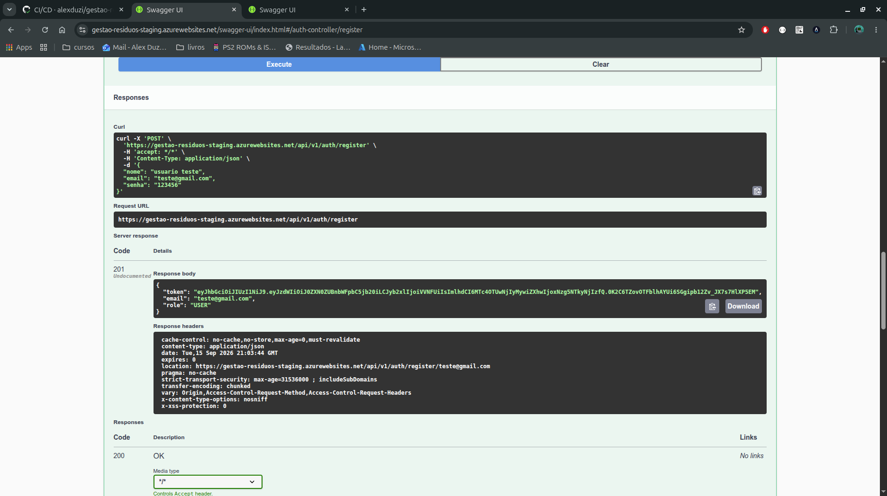
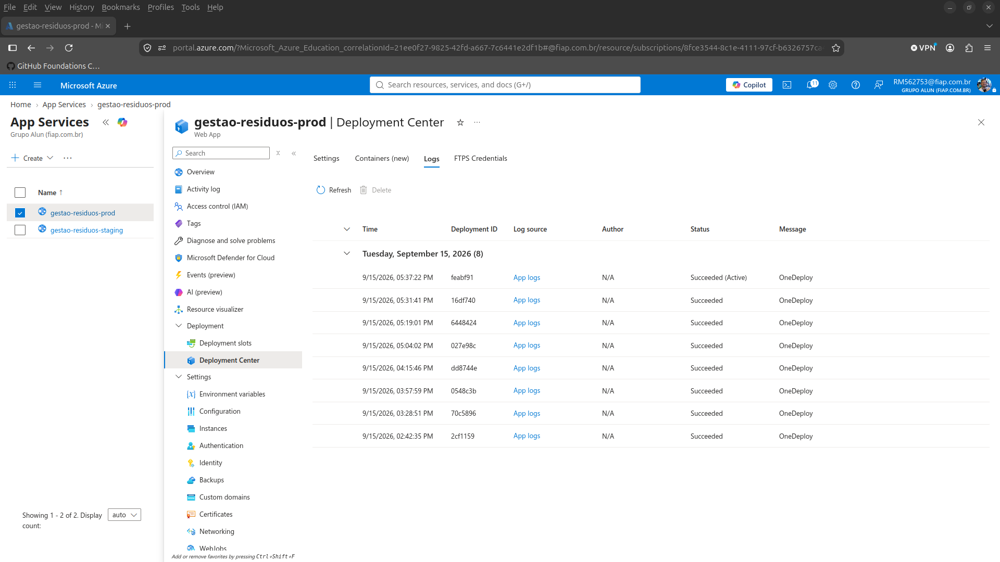
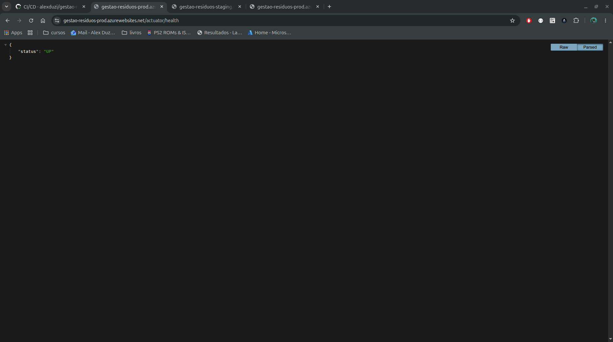
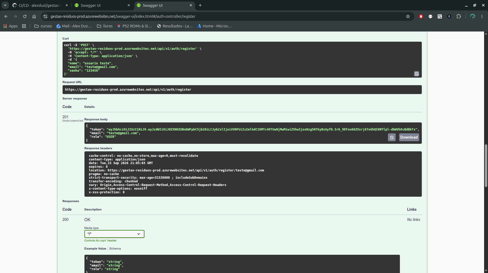
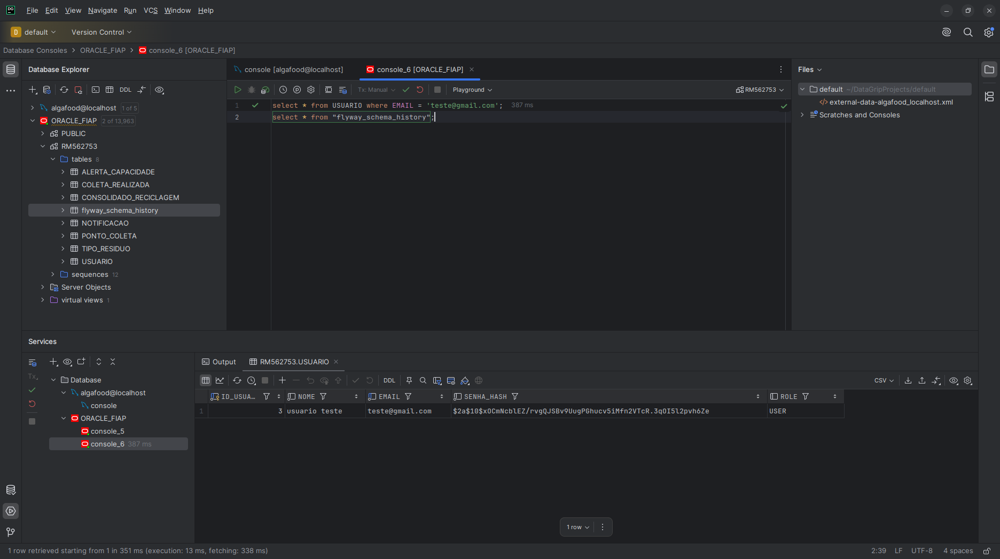

# Projeto - Gestão de Resíduos e Reciclagem (ESG)

API RESTful desenvolvida com Spring Boot para gestão de resíduos e reciclagem, tema ESG.
Projeto da disciplina Java Advanced (FIAP), adaptado nesta atividade para incorporar um
pipeline de CI/CD completo com deploy automatizado em dois ambientes (staging e produção).

---

## Como executar localmente com Docker

```bash
cp .env.example .env
# edite o .env se quiser trocar DB_USER/DB_PASS/JWT_SECRET
docker compose up --build
```

Isso sobe dois containers: `oracle` (Oracle XE 21, leva de 1 a 3 minutos para inicializar na
primeira vez) e `app` (a API, que só inicia depois que o Oracle responde saudável).

- API: `http://localhost:8080`
- Swagger UI: `http://localhost:8080/swagger-ui.html`
- Health check: `http://localhost:8080/actuator/health`

Para rodar só a aplicação, apontando para um Oracle externo já existente (sem subir o
container do banco):

```bash
docker build -t esg-residuos-app:latest .
docker run -d -p 8080:8080 \
  -e DB_USER=seu_usuario -e DB_PASS=sua_senha \
  -e SPRING_DATASOURCE_URL='jdbc:oracle:thin:@host:1521:SID' \
  esg-residuos-app:latest
```

---

## Pipeline CI/CD

**Ferramenta**: GitHub Actions, com um workflow único em
[`.github/workflows/ci-cd.yml`](.github/workflows/ci-cd.yml), disparado em todo push/PR para
`main` (e manualmente via `workflow_dispatch`).

**Etapas** (jobs em sequência, cada um dependendo do anterior):

1. **`build-and-test`**: roda em todo push e pull request. Executa `./mvnw test` (profile
   `test`, H2 em memória, sem depender de nenhum banco externo) e empacota o `.jar`, publicado
   como artifact do workflow.
2. **`deploy-staging`**: baixa o jar e publica no Azure App Service de staging
   (`azure/webapps-deploy@v3`), autenticado via OIDC. Faz um smoke test em
   `GET /actuator/health` antes de considerar o job concluído.
3. **`deploy-production`**: só roda depois que o staging passa. Mesma lógica de deploy e
   smoke test, publicando no Azure App Service de produção.

Cada ambiente é um Azure App Service (Linux, Java 21) separado, com suas próprias variáveis
de ambiente (`SPRING_PROFILES_ACTIVE`, credenciais de banco, `JWT_SECRET`) configuradas
diretamente no App Service. Staging roda com H2 em memória (efêmero); produção roda com o
Oracle da FIAP. Chegamos a uma esteira funcional cobrindo build, testes automatizados e deploy
automatizado nos dois ambientes exigidos pela atividade.

---

## Containerização

**Dockerfile** (build multistage):

```dockerfile
# ---- Build stage ----
FROM eclipse-temurin:21-jdk-alpine AS build
WORKDIR /app

COPY .mvn/ .mvn/
COPY mvnw pom.xml ./
RUN chmod +x mvnw && ./mvnw -B -ntp dependency:go-offline

COPY src/ src/
RUN ./mvnw -B -ntp clean package -DskipTests

# ---- Runtime stage ----
FROM eclipse-temurin:21-jre-alpine
WORKDIR /app
RUN apk add --no-cache curl \
    && addgroup -S spring && adduser -S spring -G spring
COPY --from=build /app/target/*.jar app.jar
USER spring:spring
EXPOSE 8080
HEALTHCHECK --interval=15s --timeout=5s --start-period=40s --retries=5 \
    CMD curl --fail http://localhost:8080/actuator/health || exit 1
ENTRYPOINT ["java", "-jar", "app.jar"]
```

- **Build multistage**: o estágio de build baixa as dependências antes de copiar o código-fonte
  (aproveita cache de camada do Docker), e só o `.jar` final vai para a imagem de runtime, que
  fica bem menor que a imagem de build.
- **Usuário não-root** (`spring:spring`) rodando a aplicação.
- **`HEALTHCHECK`** embutido, batendo em `/actuator/health`. É usado pelo `docker-compose.yml`
  (`depends_on: condition: service_healthy`) e é compatível com o probe de saúde do Azure App
  Service.

**`docker-compose.yml`** orquestra dois serviços, com volume, variáveis de ambiente e rede:

- `oracle` (`gvenzl/oracle-xe:21-slim`), com volume nomeado `oracle_data` para persistir os
  dados entre restarts, e healthcheck próprio.
- `app`, com variáveis de ambiente injetadas via `.env`, `depends_on: oracle: condition:
  service_healthy`, e seu próprio healthcheck.

Os dois serviços compartilham a rede default criada automaticamente pelo Compose (`app` fala
com `oracle` pelo nome do serviço, `oracle:1521`).

---

## Prints do funcionamento

### Pipeline (GitHub Actions)

Execução completa do workflow, com build, testes e deploy em staging e produção, todos verdes:



Os dois Azure App Service provisionados (um por ambiente):



### Staging








### Produção










---

## Tecnologias utilizadas

- Java 21
- Spring Boot 3.3.4
- Spring Security + JWT (jjwt 0.12.6)
- Spring Data JPA + Hibernate
- Oracle Database (ojdbc11) / H2 (staging e testes)
- Flyway (migrações de banco)
- Spring Boot Actuator (health check)
- SpringDoc OpenAPI (Swagger UI)
- Lombok
- Docker + Docker Compose
- GitHub Actions (CI/CD)
- Azure App Service (deploy)

---

## Documentação funcional

<details>
<summary>Estrutura do projeto, endpoints, regras de negócio e configuração</summary>

### Estrutura do projeto

```
src/
├── config/               # CORS, OpenAPI
├── controller/           # Endpoints REST
├── domain/               # Entidades JPA
├── dto/
│   ├── request/          # Payloads de entrada com validações
│   └── response/         # Payloads de saída (Records)
├── exception/            # Exceptions customizadas e handler global
├── infra/
│   └── security/         # JWT filter, UserDetailsService, SecurityConfig
├── repository/           # Interfaces JpaRepository
└── service/              # Regras de negócio

resources/
└── db/migration/
    ├── V1__create_tables.sql       # DDL completo
    ├── V2__insert_initial_data.sql # Dados iniciais de domínio
    └── V3__insert_users.sql        # Usuários padrão do sistema
```

### Profiles

| Profile | Banco | Flyway | Uso |
|---|---|---|---|
| `test` | H2 in-memory | Off | Padrão, usado em CI e nos testes locais |
| `staging` | H2 in-memory em modo Oracle | On | Deploy em staging (Azure) |
| `dev` | Oracle (XE local via Docker Compose, ou FIAP) | On | Desenvolvimento com banco real |
| `prod` | Oracle da FIAP | On | Deploy em produção (Azure) |

### Variáveis de ambiente

| Variável | Padrão | Descrição |
|---|---|---|
| `DB_USER` | `system` | Usuário do Oracle |
| `DB_PASS` | `oracle` | Senha do Oracle |
| `JWT_SECRET` | *(valor embutido)* | Secret Base64 para assinar o JWT |
| `JWT_DURATION` | `86400` | Duração do token em segundos |
| `CORS_ORIGINS` | `*` | Origens permitidas por CORS |

### Usuários padrão (criados pela migração V3, profile `dev`)

| E-mail | Senha | Role |
|---|---|---|
| `admin@esg.com` | `admin123` | `ADMIN` |
| `user@esg.com` | `user123` | `USER` |

### Endpoints

| Grupo | Prefixo | Autenticação |
|---|---|---|
| Autenticação | `/api/v1/auth` | Público |
| Tipos de Resíduo | `/api/v1/tipos-residuo` | USER / ADMIN |
| Pontos de Coleta | `/api/v1/pontos-coleta` | USER / ADMIN |
| Coletas Realizadas | `/api/v1/coletas` | USER / ADMIN |
| Alertas | `/api/v1/alertas` | USER / ADMIN |
| Consolidado | `/api/v1/consolidado` | USER |
| Notificações | `/api/v1/notificacoes` | USER / ADMIN |

Operações de escrita (POST, PUT, PATCH, DELETE) exigem role `ADMIN`. Documentação completa em
`/swagger-ui.html` (com a aplicação rodando) ou no arquivo `api.http` na raiz do projeto.

### Regras de negócio principais

- **Registro de coleta** (`POST /coletas`) zera o `volumeAtualKg` do ponto de coleta, atualiza
  ou cria o `CONSOLIDADO_RECICLAGEM` do mês correspondente, e resolve alertas pendentes do
  ponto.
- **Atualização de volume** (`PATCH /pontos-coleta/{id}/volume`) gera automaticamente um
  `AlertaCapacidade` se o volume atingir ou ultrapassar 90% da capacidade máxima.

</details>

---

## Checklist de entrega

| Item | OK |
|---|---|
| Projeto compactado em `.ZIP` com estrutura organizada | ☑ |
| Dockerfile funcional | ☑ |
| `docker-compose.yml` ou arquivos Kubernetes | ☑ |
| Pipeline com etapas de build, teste e deploy | ☑ |
| `README.md` com instruções e prints | ☑ |
| Documentação técnica com evidências (PDF ou PPT) | ☑ |
| Deploy realizado nos ambientes staging e produção | ☑ |

---

## Equipe

Projeto desenvolvido para a disciplina de DevOps, FIAP 2026.
